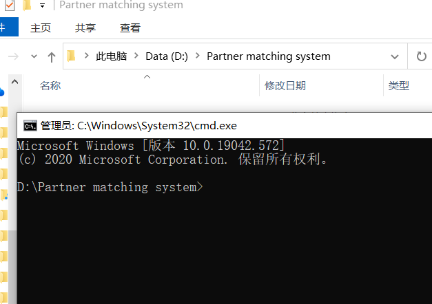
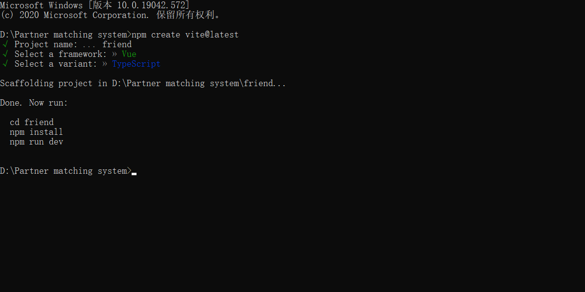
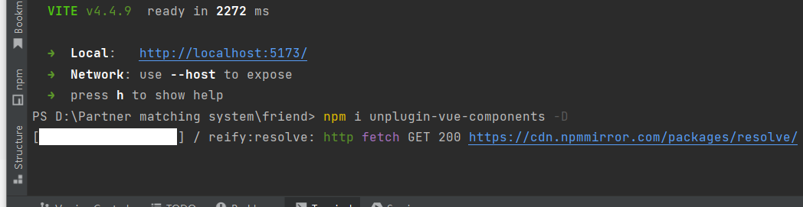
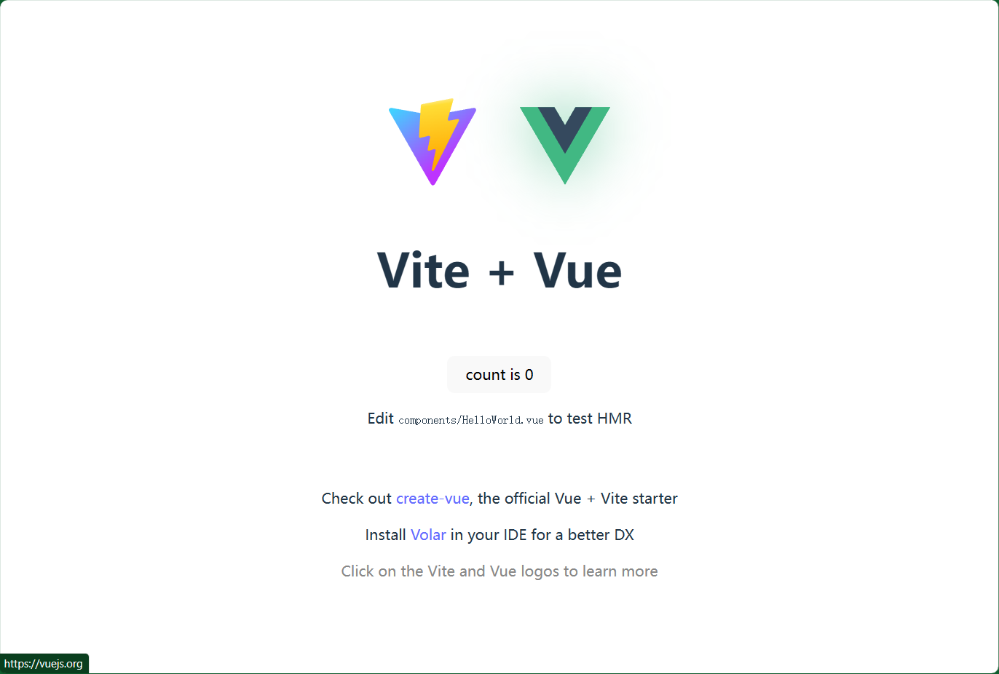
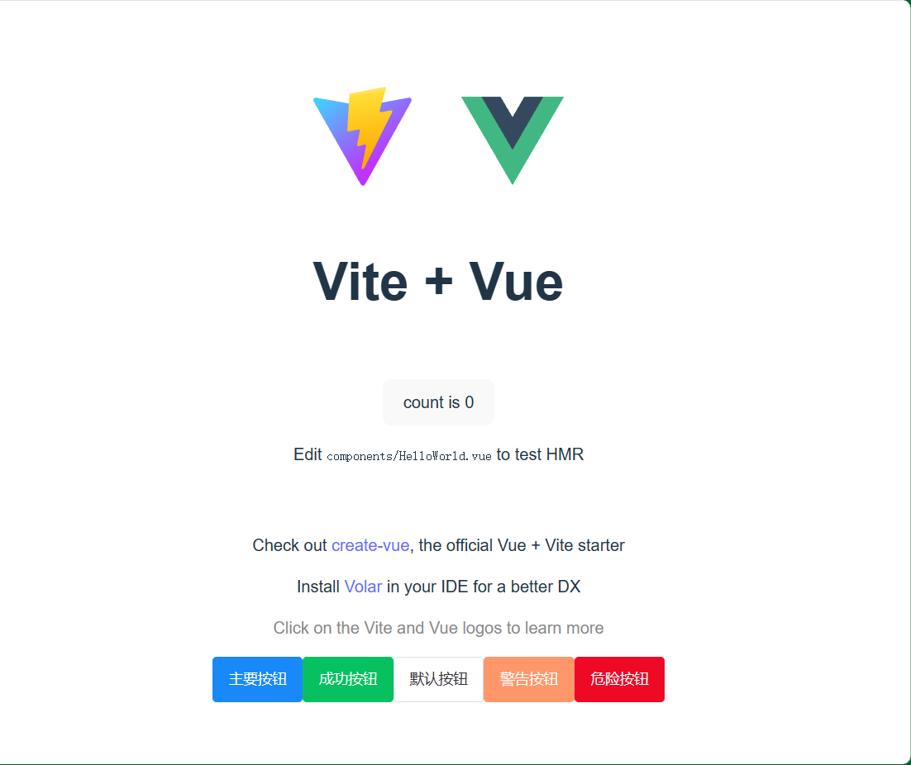

# 伙伴匹配系统 前端
介绍：帮助大家找到志同道合的伙伴，移动端 H5 网页（尽量兼容 PC 端）

1. Vue 3 开发框架（提高页面开发的效率）
2. Vant UI（基于 Vue 的移动端组件库）（React 版 Zent）
3. Vite 2（打包工具，快！）
4. Nginx 来单机部署

## 前端项目初始化

vite脚手架： [开始 | Vite 官方中文文档 (vitejs.dev)](https://cn.vitejs.dev/guide/)

- 创建项目文件夹
- 在项目文件夹处直接输入`cmd`可快速打开文件夹
 
- 通过官网导入vite，构建项目;  输入项目名以及选择框架
 

- 打开文件夹，查看文件夹初始内容
- 根据提示安装依赖，启动项目
 
 

- `ctrl + c`  停止项目

- 安装vant4组件库(按需引入)   `npm i unplugin-vue-components -D`

- 新手建议全局引入

  ~~~js
  // 在src/main.js进行全局引入
  import Vant from 'vant'
  import 'vant/lib/index.css';
  Vue.use(Vant)
  ~~~

- 安装完成后跟着官网快速上手继续配置插件
- 简单使用两个组件，检查是否成功（以下是成功图）
 

- 考虑页面布局  想好思路 （公司有美工设计，还原）

## 前端主页 组件概览

### 设计页面

页面内容：

- **主页**（推荐 + 广告位 --- 商业盈利）
    - 顶部 --- 搜索框
    - banner
    - 推荐信息流

- **队伍页**
- **用户页**
    - 个人信息 --- 标签

### 开发

- 先删除初始项目不相关的文件  ---- 开始开发
- 根据页面内容  搭建基本框架
- 考虑页面信息  可以抽象出一个通用布局组件

#### 整合路由

[入门 | Vue Router (vuejs.org)](https://router.vuejs.org/zh/guide/)

- 采用 编程式导航

    1. `router.push()` 方法向 history 栈添加一个新的标记，当点击回退键时就会回到之前的 URL。

    2. 该方法的参数可以是一个字符串路径，或者一个描述地址的对象。

> Vue Router 其实就是帮助你根据不同的 url 来展示不同的页面（组件），不用自己写 if / else
>
> 路由配置影响整个项目，所以**建议单独用 config 目录、单独的配置文件去集中定义和管理**。
>
> 有些组件库可能自带了和 Vue-Router 的整合，所以尽量先看组件文档、省去自己写的时间。

- 前端页面跳转传值

1. query => url searchParams，url 后附加参数，传递的值长度有限

   >  **query 传参类似于网络请求中的 get 请求，query 传过去的参数会拼接在地址栏中（?name=xx）。query 较为灵活既可以配合 path 使用，也能配合 name 使用（亲测可用）。**

2. Vuex（全局状态管理），搜索页将关键词塞到状态中，搜索结果页从状态取值

[开始 | Vuex (vuejs.org)](https://vuex.vuejs.org/zh/guide/)

[Vue路由传参详解（params 与 query） - 知乎 (zhihu.com)](https://zhuanlan.zhihu.com/p/401543586)

**难点**

搜索页面   搜索过滤